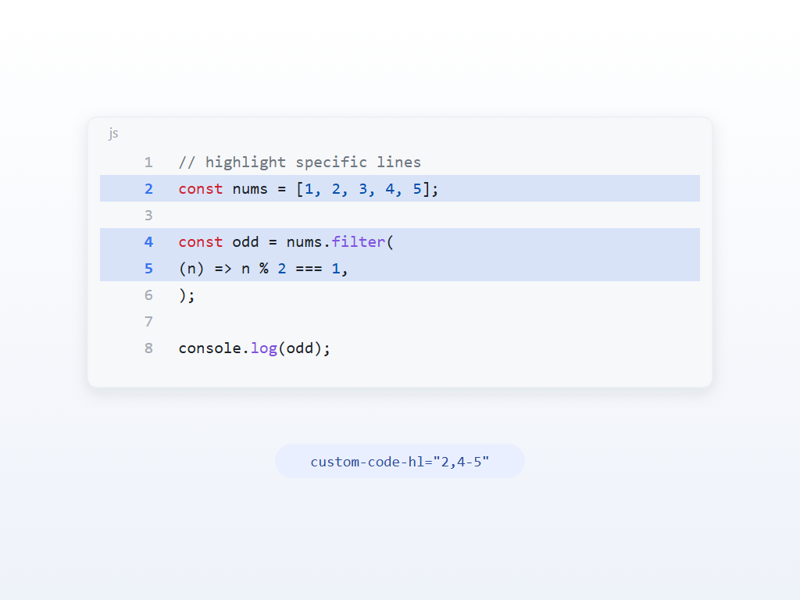

# Siyuan Line Glow

Highlight the lines that matter in SiYuan code blocks, using the VitePress line range syntax.

[](https://github.com/Talyra42/siyuan-lineglow/blob/main/LICENSE)
[](https://b3log.org/siyuan)



[简体中文](./README.zh-CN.md)

## Why this plugin

Notes and tutorials constantly need to say "look at lines 4 to 6". SiYuan has no built-in way to do it, and the common fenced syntax ` ```js {4-6} ` **cannot work here**: SiYuan's Markdown engine Lute truncates the fence info at the first space, so `{4-6}` is discarded while parsing — it never reaches the DOM and is never saved.

This plugin takes a different route: the line ranges are stored in the code block's **block attribute** `custom-code-hl`, and the highlight is drawn at render time. The attribute travels with the `.sy` file, sync and history, and it does not interfere with the block's language detection.

## ✨ Features

- 🎯 **Line ranges** - Single lines, ranges and multiple groups, with the VitePress syntax
- 🎨 **Whole line background** - Configurable color and opacity, at home in light and dark themes
- 🔢 **Line numbers** - The matching line numbers change color, optionally bold
- ⚙️ **Per block override** - Override the global styles on a single code block
- ⌨️ **Shortcut** - `⌥⌘H` by default, remappable in `Settings` - `Keymap`
- 🌐 **Localized** - Simplified Chinese and English UI

## 📦 Installation

### From the marketplace (recommended)

1. Open SiYuan
2. Go to `Settings` - `Marketplace` - `Plugins`
3. Search for `Line Glow`
4. Install and enable

### Manually

1. Download `package.zip` from [Releases](https://github.com/Talyra42/siyuan-lineglow/releases)
2. Unzip it into `<workspace>/data/plugins/siyuan-lineglow`
3. Restart SiYuan and enable it in `Settings` - `Marketplace` - `Downloaded`

> The workspace is the folder that contains `data`, not the folder of a single notebook.

## 🚀 Usage

Three entry points, use whichever you like:

| Entry | How |
|---|---|
| Block menu | Click the block icon on the left of a code block → `Plugin` - `Line Glow` |
| Shortcut | Put the cursor inside the code block and press `⌥⌘H` |
| Block attribute | Edit `custom-code-hl` directly in the block attribute panel |

The dialog previews the result **while you type**, and writes the attribute when you confirm.

## 📝 Line range syntax

Identical to VitePress. Lines are counted from 1 and ranges are inclusive:

| Value | Meaning |
|---|---|
| `3` | highlight line 3 only |
| `4-6` | highlight lines 4 to 6 |
| `1,4-6,9` | highlight lines 1, 4, 5, 6 and 9 |

A few tips:

- To highlight a whole block, use `1-9999`; anything past the last line is ignored
- Separate groups with an **ASCII comma**; a full-width comma is skipped as an invalid fragment
- Ranges are merged and de-duplicated, so `1,2,3` equals `1-3`

## 🎛️ Styles

Global styles live behind the gear icon of `Settings` - `Marketplace` - `Downloaded` - `Line Glow`: master switch, background switch/color/opacity, line number switch/color/bold.

To style **one code block** differently, add `custom-code-hl-style` to its block attributes (same panel as `custom-code-hl`):

| Token | Effect |
|---|---|
| `bg` / `no-bg` | turn the line background on / off |
| `num` / `no-num` | turn the line number coloring on / off |
| `all` / `none` | turn every style on / off |

For example `custom-code-hl-style="num,no-bg"` keeps the line number coloring only. Blocks without this attribute simply follow the global settings.

## ❓ FAQ

**Why can't I write ` ```js {4-6} `?**
Because SiYuan's parser truncates the fence info (see "Why this plugin" above). The fenced syntax is not "not supported yet" here — it simply cannot be stored.

**Why is there no highlight in exported PDF / HTML / images?**
Exports are produced by SiYuan outside of the plugin runtime, so plugins cannot take part. It is a known limitation; the block and its attribute are untouched, so editing, syncing and re-importing all keep working.

**Why don't the line numbers change color?**
The line number coloring only shows when the code block displays line numbers. If it is off (block menu → `Line numbers`), you will only see the background.

**Will uninstalling the plugin break my notes?**
No. The plugin only adds one `custom-*` attribute to the code block. After uninstalling, the attribute stays but nothing renders it, and notes, search and export keep working.

## ⚡ Performance and stability

- **The code block markup is never modified**: the highlight is drawn with inline styles on the code body plus one injected CSS rule, so nothing is serialized into the note and the caret and undo history stay intact
- **The number of background layers is constant**: every band is merged into a single vertical gradient, so exactly 1 layer exists no matter how many ranges are highlighted
- **Debounced and bounded**: DOM changes are coalesced with a 160ms debounce, a single block handles at most 200 ranges, and an attribute longer than 4096 characters is ignored
- **Long documents are scanned in batches** of 40 code blocks
- **Nothing leaks**: unload removes every listener, observer and injected style, and ResizeObserver entries for detached blocks are released during a full scan

## 🛠️ Development

Install [NodeJS](https://nodejs.org/en/download) and [pnpm](https://pnpm.io/installation).

| Command | What it does |
|---|---|
| `pnpm install` | install dependencies |
| `pnpm dev` | watch build into `<workspace>/data/plugins/siyuan-lineglow` |
| `pnpm test` | unit tests, DOM integration tests, scanner lifecycle tests and performance guardrails |
| `pnpm typecheck` | type check |
| `pnpm lint` | lint |
| `pnpm build` | produce `dist/` and the release `package.zip` |
| `pnpm release` | interactive release: bump version → commit → tag → push (CI creates the GitHub Release) |

`asset/` holds the SVG sources of the icon and the preview. Re-export them as `icon.png` (160×160) and `preview.png` (1024×768) in the repository root after editing.

## 📄 License

[MIT](./LICENSE)
